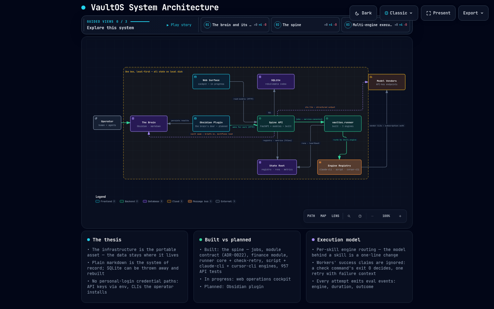
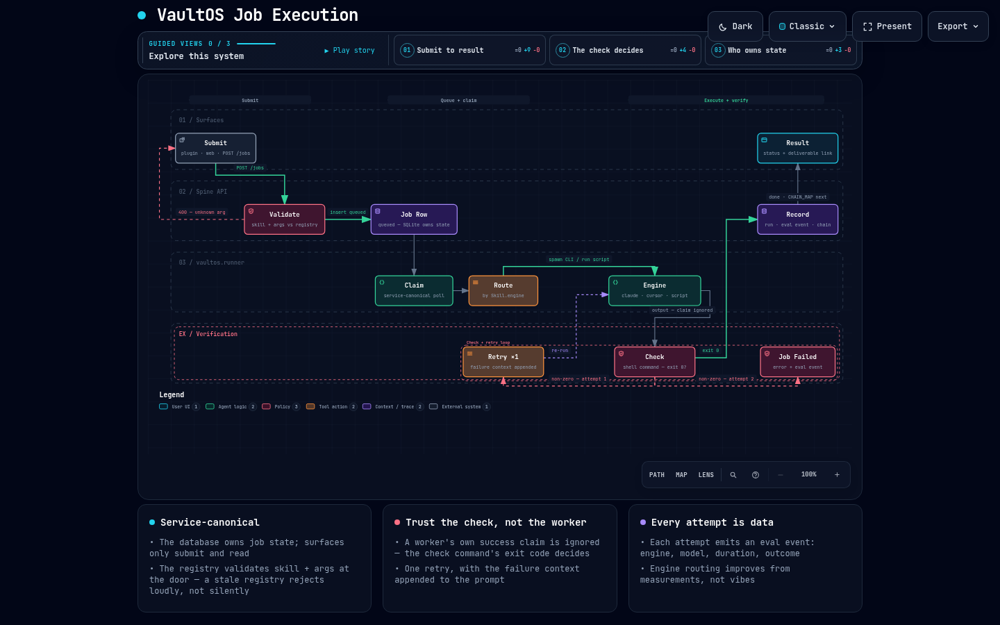

# VaultOS

A local-first personal automation platform: plain-markdown knowledge that stays
yours, jobs that leave an auditable record, and a model-provider seam you can
point at whatever endpoint you're allowed to use.

> **The infrastructure is the portable asset. The data stays where it lives.**

## Components

| | | |
|---|---|---|
| [`api/`](api/) | the spine | FastAPI + SQLite. Job execution as an auditable record, module contract (ADR-0022), a personal-finance module as the first worked example. **This is the built part.** |
| `web/` | the surface | planned — a web frontend over the spine's read-models, with its own store for web-native state |
| `plugin/` | the door | planned — an Obsidian plugin: the knowledge vault asks the spine for work and persists the results; how the work happens stays hidden |

The architecture in one sentence: a **brain** (your markdown vault — the
document store and system of record), a **spine** (`api/` — infrastructure
execution: jobs, modules, model providers), and thin surfaces that never own
what either of those own.

## The system in two pictures

Click either image for the interactive version — pan/zoom, guided story
views, theme toggle, and exports (open the HTML raw in a browser).

**Status: pre-1.0, single-operator.** The api runs daily against a live vault
and has 791 tests; interfaces change without deprecation cycles. Read it as a
worked example of the architecture, not something to depend on yet.

## Start here

- [`api/README.md`](api/README.md) — what's actually built, quickstart, the ADR index.
- [`api/docs/adr/`](api/docs/adr/) — every non-obvious decision.
- [`api/docs/specs/`](api/docs/specs/) — the design specs the code was built from.
- [`docs/architecture/vaultos-architecture.html`](https://mlutton.github.io/vault-os/architecture/vaultos-architecture.html) — the interactive system diagram, with [`vaultos-job-execution.html`](https://mlutton.github.io/vault-os/architecture/vaultos-job-execution.html) covering the job-execution flow (source specs sit beside them in the repo).

## License

[Apache-2.0](LICENSE).
