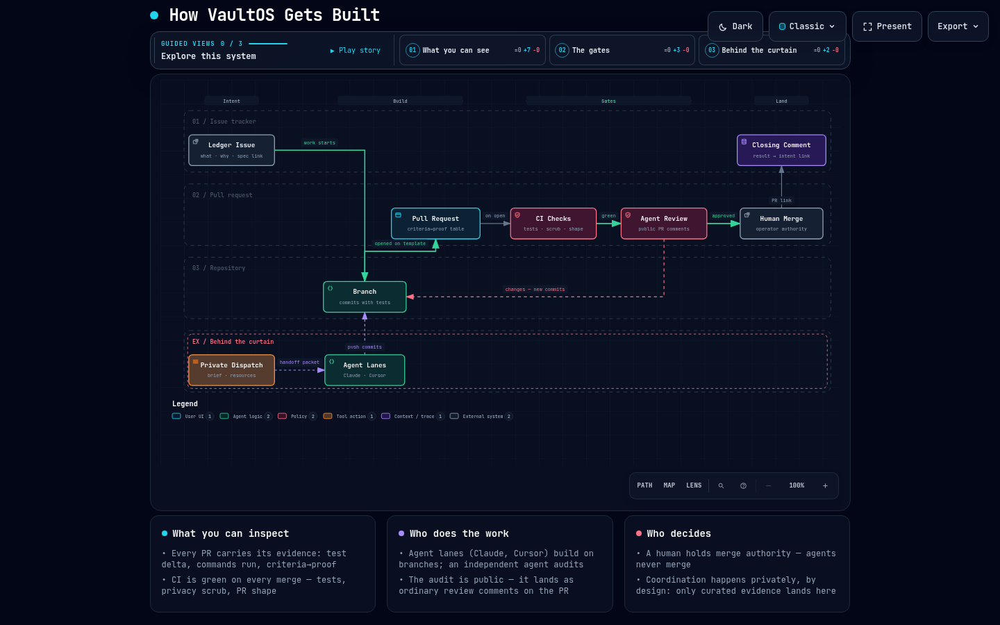

# VaultOS

A working test of how software gets built when AI agents do most of the
typing and platform-engineering discipline sets the bar: contracts at the
seams, decisions on the record, verification gates that don't care who wrote
the code, and a human holding the merge.

The workbench is a local-first personal automation platform: plain-markdown
knowledge that stays yours, jobs that leave an auditable record, and a
model-provider seam you can point at whatever endpoint you're allowed to use.
It runs every day against a live vault, so each practice here is exercised
on real work, by the person who has to live with the result.

> **The infrastructure is the portable asset. The data stays where it lives.**

## Why this shape, and not a smaller one

A personal second brain doesn't need a module contract, a reconciling job
spine, an engine registry, or a preflight with six gates. This one has them
because the point is to work the way a platform team has to, on a codebase
small enough to change in a day, and find out which practices earn their
keep. The choices are one operator's, but they're written down so anyone can
weigh them against their own team.

What the repository is used to test, and where to check the evidence:

| Question | Where to look |
|---|---|
| Can the delivery loop run mostly through agents without lowering the bar? | [How VaultOS gets built](https://mlutton.github.io/vault-os/architecture/vaultos-dev-orchestration.html): issues state intent, PRs carry their own evidence, CI and a privacy scrub review every change, a human merges. The [PR template](.github/PULL_REQUEST_TEMPLATE.md) and [`./preflight`](preflight) are the mechanism. |
| Do seams and contracts pay off at one-person scale? | [ADR-0022](api/docs/adr/0022-modules-are-packages-with-a-registration-contract.md): modules as packages behind a registration contract. The finance module is the first one held to it. |
| Can the record of work be trusted without trusting the runner? | [Job execution](https://mlutton.github.io/vault-os/architecture/vaultos-job-execution.html): the vault's files are the source of truth, the database is a rebuildable index, and dead runners are detected rather than assumed. [ADR-0001](api/docs/adr/0001-reconciliation-shares-the-event-application-path.md), [ADR-0016](api/docs/adr/0016-jobs-can-auto-chain-a-followup-via-chain-map.md). |
| Does it survive a locked-down machine and a sanctioned-endpoints-only policy? | CPU-only, all state on local disk, adapters that read exports rather than live APIs, and a provider seam that takes an enterprise endpoint. The seam is the current build: [design spec](api/docs/specs/2026-09-04-llm-provider-module-design.md). |
| Can several coding-agent CLIs share one set of instructions without drifting? | [`docs/agents/shared.md`](docs/agents/shared.md): one file, every vendor entry point imports it, a read-receipt token proves it was read, and a gate validates the surface. |

Every non-obvious decision is an ADR and every build starts from a spec.
They're written to be lifted out and argued about elsewhere: if a practice
transfers to a team, the record shows why; if it doesn't, the record shows
that too.

## Components

| | | |
|---|---|---|
| [`api/`](api/) | the spine | FastAPI + SQLite. Job execution as an auditable record, module contract (ADR-0022), a personal-finance module as the first module held to the contract. **This is the built part.** |
| [`web/`](web/) | the surface | in progress — the operations cockpit's skill deck is built; live status, run history, metrics, and later panels remain planned |
| `plugin/` | the door | planned — an Obsidian plugin: the knowledge vault asks the spine for work and persists the results; how the work happens stays hidden |

The architecture in one sentence: a **brain** (your markdown vault — the
document store and system of record), a **spine** (`api/` — infrastructure
execution: jobs, modules, model providers), and thin surfaces that never own
what either of those own.

## The system in three pictures

Click any image for the interactive version — pan/zoom, guided story
views, theme toggle, and exports (open the HTML raw in a browser).

The first is the one that says what this repository is about. It shows what
you'll actually see here: issues stating intent, PRs carrying their own
evidence, CI gates, agent review comments, and a human holding the merge.
The agent coordination behind it stays off-stage by design:

[](https://mlutton.github.io/vault-os/architecture/vaultos-dev-orchestration.html)

The second is the system itself, with the local-first boundary drawn:

[](https://mlutton.github.io/vault-os/architecture/vaultos-architecture.html)

The third is one job's life, from submission to an auditable record:

[](https://mlutton.github.io/vault-os/architecture/vaultos-job-execution.html)

**Status: pre-1.0, single-operator.** The api runs daily against a live vault
and has 961 tests; interfaces change without deprecation cycles. Read it as a
worked example of the architecture, not something to depend on yet.

Run `./preflight` from the repository root before submitting a change. It runs
lint and formatting checks, the API suite, privacy and documentation checks,
and instruction-surface validation; use `./preflight --only <gate>` to iterate
on one gate.

Gates that choose their own files — the privacy scrub, and the documentation
check's file count — judge the files git reports, tracked plus untracked and
not ignored, rather than walking the filesystem, so build output and other
checkouts inside the tree cannot influence them. The gates that delegate
discovery to another tool inherit that tool's rules instead: `ruff` and the web
toolchain are scoped to their own component, while `pytest` collects by walking
and does not read `.gitignore`, so an ignored test file still counts toward the
suite. Gates also write nothing outside the repository — their caches and tool
state live in gitignored paths inside it — which is what lets a gate run
unchanged inside a sandbox with no writable home directory.

### Web quickstart

The web component uses its own npm toolchain and runs on port 3110:

```bash
npm ci --prefix web
export NEXT_PUBLIC_API_BASE_URL="<API base URL>"
npm run dev --prefix web
```

Run its complete local gate with `./preflight --only web`.

## Start here

- [`api/README.md`](api/README.md) — what's actually built, quickstart, the ADR index.
- [`api/docs/adr/`](api/docs/adr/) — every non-obvious decision.
- [`api/docs/specs/`](api/docs/specs/) and [`docs/specs/`](docs/specs/) — the design specs the code was built from.
- [`docs/agents/shared.md`](docs/agents/shared.md) — the instructions every coding agent reads before working in this repository.
- [`docs/architecture/vaultos-dev-orchestration.html`](https://mlutton.github.io/vault-os/architecture/vaultos-dev-orchestration.html) — how changes get made here, with [`vaultos-architecture.html`](https://mlutton.github.io/vault-os/architecture/vaultos-architecture.html) for the system and [`vaultos-job-execution.html`](https://mlutton.github.io/vault-os/architecture/vaultos-job-execution.html) for the job-execution flow (source specs sit beside them in the repo).

## License

[Apache-2.0](LICENSE).
